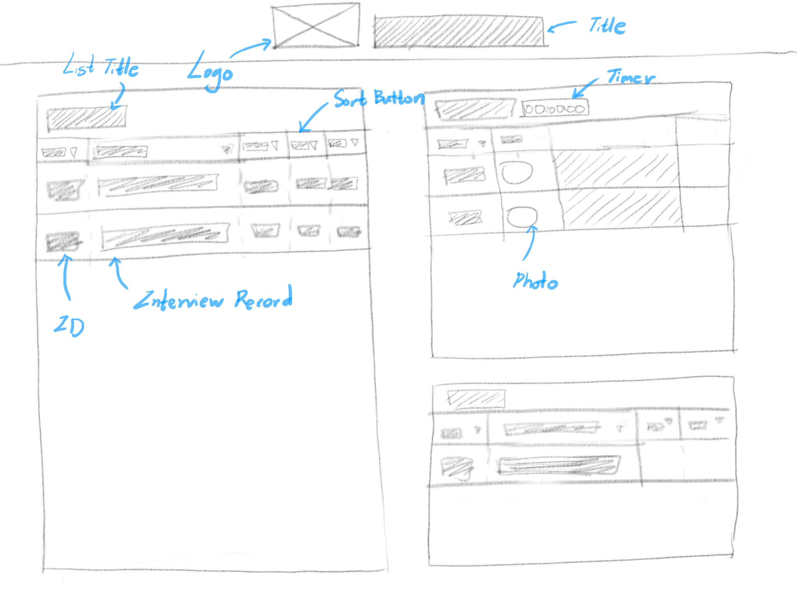
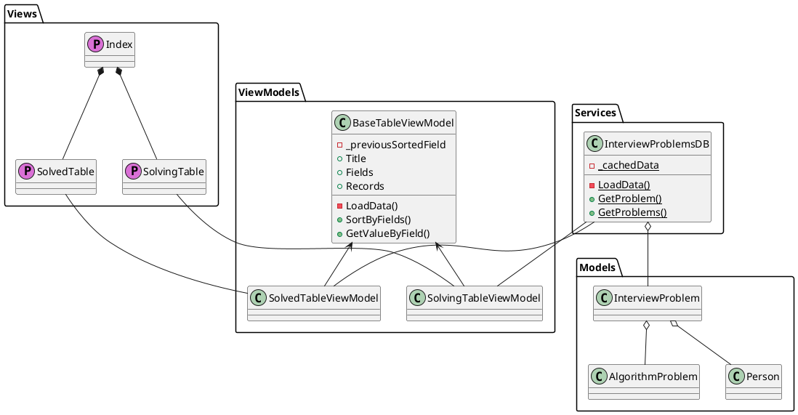

# 개발 디자인 문서

## 웹디자인



## 데이터 저장

데이터의 크기가 많이 크기 않으므로 Json 파일로 파일시스템에 저장한다.

## 소스코드 아키텍처 디자인 패턴
.NET을 포함해 다양한 앱 개발 많이 쓰이는 Model-View-ViewModel(MVVM) 패턴 사용한다.

## 클래스 설계

### Razor Pages (Views)

크게 사용하는 View는 세 가지가 있다:

* Solved Table View : 이미 모의 인터뷰를 진행한 문제들을 기록하는 리스트
* Solving Table View : 다음 모의 인터뷰에 사용할 문제 리스트
* Random Problem View : 문제 랜덤픽 뷰

세 개의 View를 각각 razor page로 구현하고 index.razor에 컴포넌트로 추가한다.

```bash
Index.razor
├──SolvedTable.razor
├──SolvingTable.razor
└──RandomPick.razor
```

### View Models

```bash
BaseTableViewModel.cs
  ->SolvedTableViewModel.cs
  ->SolvingTableViewModel.cs
RandomPickViewModel.cs
```

### Services

```bash
InterviewProblemDB.cs
```

### Models

```bash
InterviewProblem.cs
AlgorithmProblem.cs
Person.cs
Field.cs
```

### Class UML

